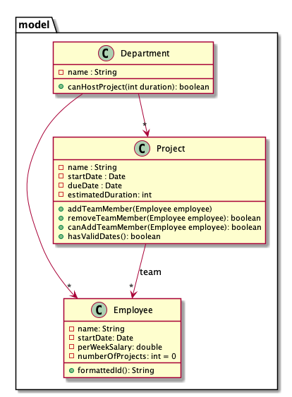

# Software Engineering Fundamentals - Lab #4: Unit Testing

### Time: 30 minutes


## Introduction

This assessment evaluates the following CLOs:

- CLO 4: implement the system using appropriate tools and techniques

- CLO 6: design and carry out tests using various testing techniques and tools


## General Scenario

Read the following scenario to give you the context of the exercise. Tests that need to be completed are in the following section.

```
Company is developing a software tool to manage employees and projects developed within the company. 
You are part of the scrum team developing the solution.

A Department can host multiple projects and has multiple employee. Each project is developed by a team.
    
```
A conceptual diagram would be:




## Rubric

* NN: Errors in tests or production code.
* PASS: Respect the given requirements for your method in common cases.
* CR: Respect the given requirements for your method in common and edge cases.
* DI: Professional testing and code quality and organization.
* HD: Flawless testing and code quality and organization.

**IMPORTANT**: Including dummy tests is NOT allowed, and marks will be deducted. 

Dummy Test example:


```java
@Test
public void isValid_False_IfMandatoryFieldsMissing(){
  assertTrue(true);
}
``` 

## Exercise
 
Using the github classroom link provided, create your assessment repository.

Clone your repository and solve the exercise below.
 
In this assessment you will need to implement the functionalities and verify your code using unit testing to ensure specifications are met.
 
#### IMPORTANT

Provided code may include bugs that you need to detect and FIX.

### DO NOT FORGET TO PUSH ALL YOUR CHANGES TO GITHUB AND SUBMIT YOUR REPOSITORY'S LINK IN CANVAS
 
### Naming convention
 
 Use the following naming convention for your tests:
 
 ```
 MethodName_ExpectedBehavior_StateUnderTest
 ```
 
For example:
 
 ```
 isValid_False_IfMandatoryFieldsMissing
 calculateBonus_ThrowsException_IfNotValidEmployee
 ```

## Your Task

Implement and test Project#addTeamMember(Employee) following the requirements specified in `src/test/java/model/ProjectTeamAddMemberTest.java`

